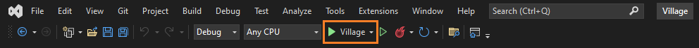
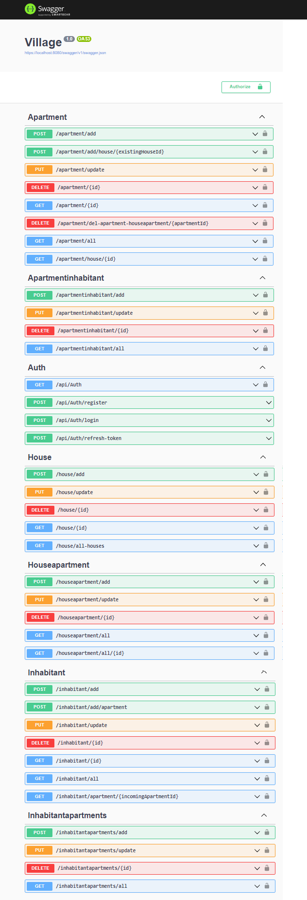
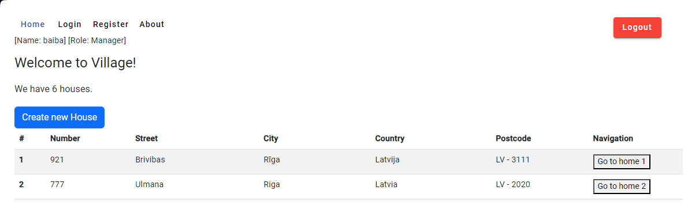
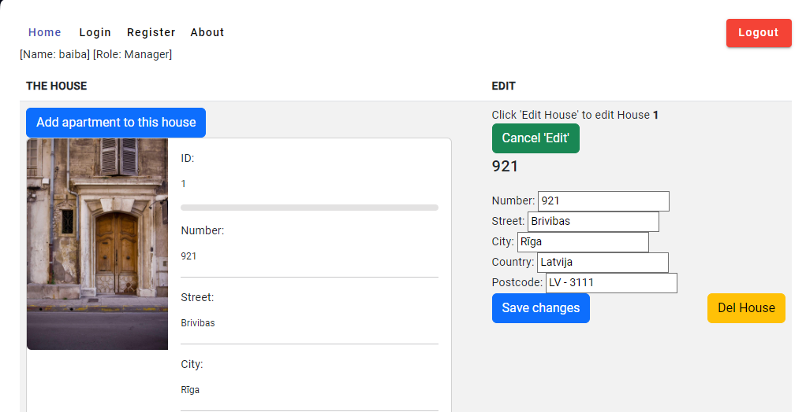
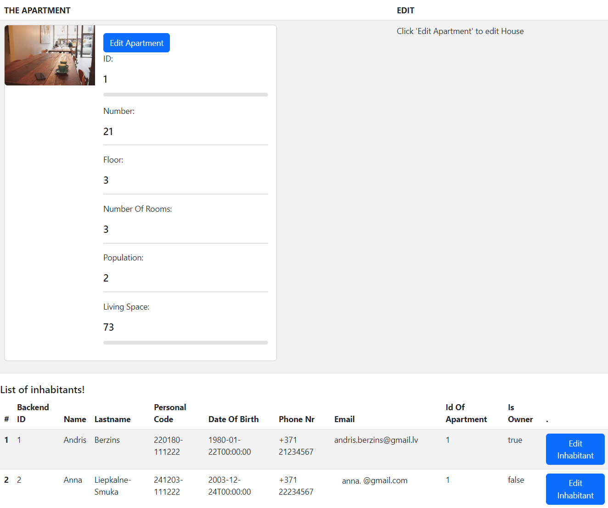
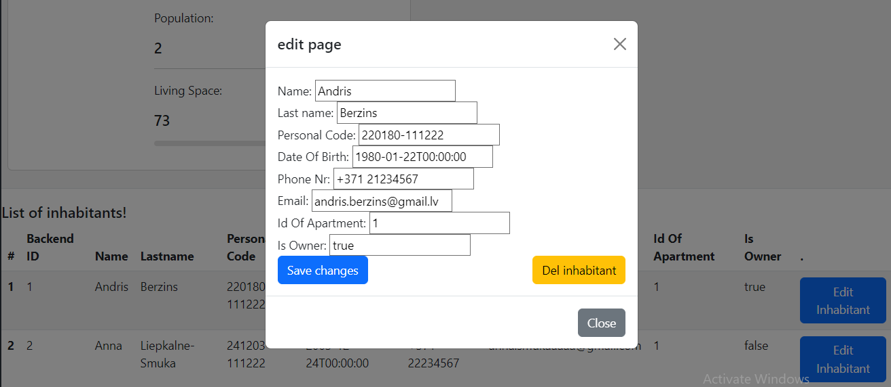

# Village
An ASP.NET Core Web API .NET 6 application which creates local Village API. And uses Angular for front-end.
## :exclamation::exclamation::exclamation: Download and install :exclamation::exclamation::exclamation:

Microsoft SQL Server Management Studio  
https://learn.microsoft.com/en-us/sql/ssms/download-sql-server-management-studio-ssms?view=sql-server-ver16

SQL Server  
https://www.microsoft.com/en-us/sql-server/sql-server-downloads

Node Js Latest LTS Version 
https://nodejs.org/en/download/

.NET 6.0  
https://dotnet.microsoft.com/en-us/download

Angular  
https://angular.io/guide/setup-local  

[blog.angular-university.io](https://blog.angular-university.io/getting-started-with-angular-setup-a-development-environment-with-yarn-the-angular-cli-setup-an-ide/)

### To run your program:

If you are new to .NET visit [microsoft.com](https://dotnet.microsoft.com/en-us/learn)

1. You need to clone or download project from GitHub [project page](https://github.com/kristaps-m/dot-net-restcountries-api)
2. You need the .NET Framework and an IDE (integrated development environment) to work with the C# language. [Try this page to get started.](https://www.simplilearn.com/c-sharp-programming-for-beginners-article)

  - :exclamation::exclamation::exclamation: You will need data to work with :exclamation::exclamation::exclamation:
  - :exclamation: In Visual Studio open Package Manager Console.
  - :exclamation: Make sure you are in Village.Data Console window.
  - :exclamation: And type 'update-database'
  - now you should see data in your Microsoft SQL Server Management Studio
  - more information [learn.microsoft.com](https://learn.microsoft.com/en-us/ef/core/cli/powershell)

3. Open and run project with capable IDE of your choice. I used Visual Studio in example below.

  - Or go to in project directory "Village\VillageBackEnd\Village" open powershell or terminal and run project using 'dotnet watch run' command.
  - If web browser does not open automatically, go to 'https://localhost:8080/swagger/index.html'

4. Visual Studio should open browser window automaticaly with Swagger project page or go 
[https://localhost:8080/swagger/index.html](https://localhost:8080/swagger/index.html)

5. To use Village API, click on 'GET /apartment/all' --> 'Try it out' --> 'Execute'. And you will see all countries available.

  - Now you can Create, Read, Update and Delete (CRUD).
  - For more information about how to use Swagger visit:
    - [https://learn.microsoft.com](https://learn.microsoft.com/en-us/aspnet/core/tutorials/web-api-help-pages-using-swagger?view=aspnetcore-6.0)
    - Or you can use Postman [https://www.postman.com/product/what-is-postman/](https://www.postman.com/product/what-is-postman/) for CRUD operations.

6. To use front end. Go to repository "Village\VillageUI" open terminal window or powershell and type 'ng serve'

  - Now go to http://localhost:4200 and it will redirect you to http://localhost:4200/all-houses

7. Now you should be able to see two default houses. You can create a new house or navigate further to one of houses.

 

8. Here you can see house with id 1, and local link http://localhost:4200/house/1
  
  - After clicking 'Edit House' Window for edit the house will appear. Now you can make changes or even delete it.
    - To delete a house it will ask for confirmation. 

9. If you click on apartment can see similar window, but with apartment id 1, and local link http://localhost:4200/apartment/1
  
  - After clicking 'Edit Apartment' Window for edit the apartment will appear. Now you can make changes or even delete it.
    - To delete a apartment it will ask for confirmation. 

  - After clicking 'Edit Inhabitant' Modal Window for edit the inhabitants will appear. Now you can make changes or even delete it.

10. Improvements in future:

- [ ] add OAuth 2.0 for Manager and Resident!
- [x] add cancel button for editing!
- [x] add Loader for data (http://localhost:4200/all-houses have 3 second loading... spinner (Village\VillageBackEnd\Village\Controllers\HouseController.cs))!
- [x] add pop up if changes are saved successfully!
- [ ] create table row as link to next page.
- [ ] improve Front End UI and visuals.
- [ ] create Front End using other frameworks.
	- [x] install Next.Js 
